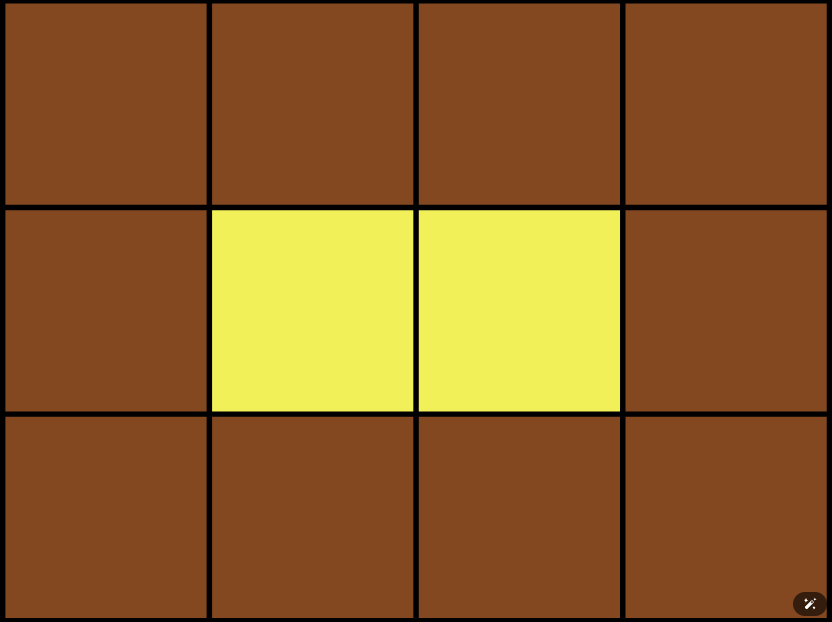

# 카펫 
## 문제 요약
- 아래와 같은 카페 모양이 있다.

- 안쪽에는 노란색, 바깥쪽에는 갈색으로 칠해져 있다.
- 격자수 노란색, 갈색으로 주어 졌을때 전체 가로, 세로 크기를 리턴 하여라

## 문제풀이
 1번, 2번, 3번 보면 일정한 패턴을 가지고 찍는다
 ```
1번: 1, 2, 3, 4, 5
2번: 2, 1, 2, 3, 2, 4, 2, 5, 2, 1, 2, 3, 2, 4, 2, 5
3번: 3, 3, 1, 1, 2, 2, 4, 4, 5, 5
 ```
위 패턴 가지고 반복해서 정답이랑 비교 해보면 된다.  
그런데 1~3번이 패턴 수가 달라서 1~3번일정 패턴을 지정하고 I번째로 패턴 길이 만큼 나눈 나머지와 점수 비교만 하면 끝이다.

## Code
```JAVA

import java.util.ArrayList;
import java.util.Arrays;
import java.util.List;

class Solution {
    public int[] solution(int[] answers) {
        List<Integer> result = new ArrayList<>();
        int size = answers.length;

        // 1번, 2번, 3번 학생의 답안지
        int[] number1 = {1, 2, 3, 4, 5};
        int[] number2 = {2, 1, 2, 3, 2, 4, 2, 5, 2, 1, 2, 3, 2, 4, 2, 5};
        int[] number3 = {3, 3, 1, 1, 2, 2, 4, 4, 5, 5};

        // 1번, 2번, 3번 학생의 정답의 개수
        int[] count = { 0, 0, 0};

        // 맞은 개수
        for (int i = 0; i < size; i++) {
            count[0] += number1[i % number1.length] == answers[i] ? 1 : 0;
            count[1] += number2[i % number2.length] == answers[i] ? 1 : 0;
            count[2] += number3[i % number3.length] == answers[i] ? 1 : 0;
        }

        // 1,2 3 번에서 많이 맞은 개수 구하기
        int maxValue = Arrays.stream(count).max().getAsInt();

        // 많이 맞은 개수인 사람 구하기
        for (int i = 0; i < 3; i++) {
            if(count[i] == maxValue){
                result.add(i + 1);
            }
        }

        return result.stream().mapToInt(Integer::intValue).toArray();
    }
}

```